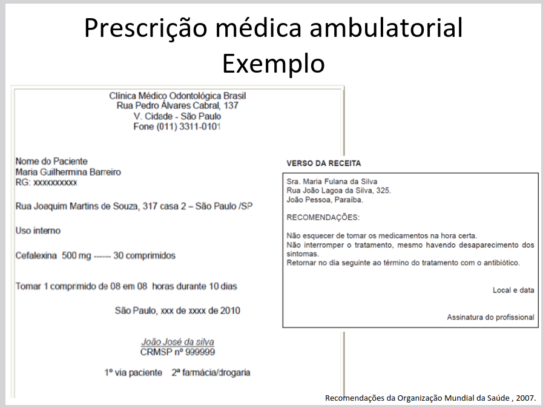
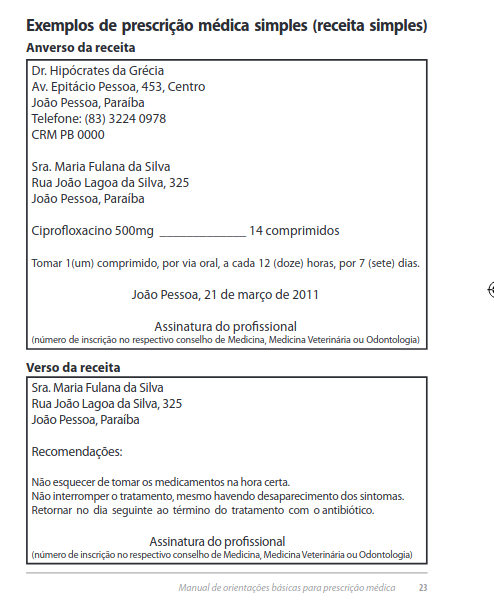
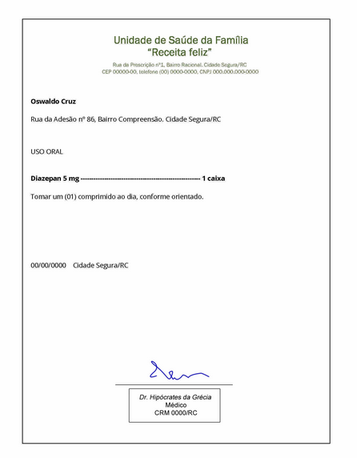

## Exemplos de prescrições:

Fonte: https://neurologiahu.paginas.ufsc.br/files/2012/08/Prescri%C3%A7%C3%A3o-racional.pdf

Fonte: https://sanarmed.com/prescricao-medica-dados-modelos-caligrafia-e-carimbo/

Fonte: https://app4.unasus.gov.br/ppuplayer4_unb/uploads/recursos/UNB_0001_DOCUMENTOS_MEDICOS/16/prescricao_medica.html

## Criação  de um exemplo para processamento da CNL:

Insulina

Injetar 1 vez por dia, de manhã

